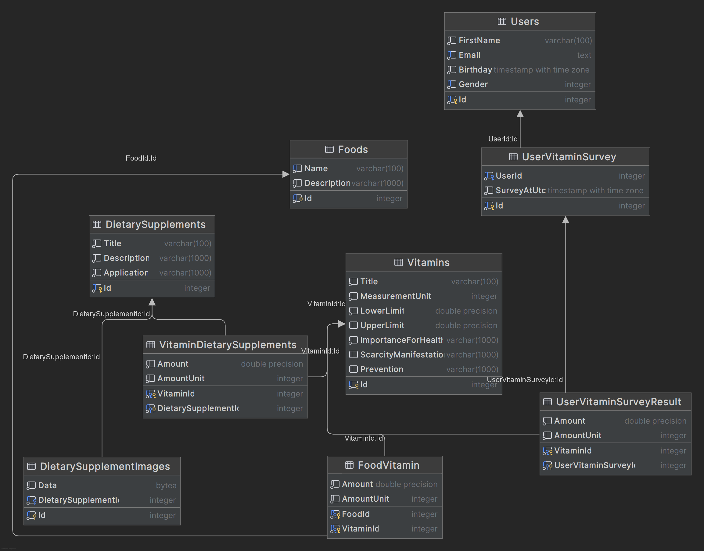

## Таблицы:

### Users:
* Id - Идентификатор пользователя
* FirstName - Имя пользователя
* Email - Электронная почта
* Birthday - Дата рождения
* Gender - Пол

### UserVitaminSurvey - Связующая таблица между Users и UserVitaminSurveyResult (у одного пользователя может быть несколько пройденных опросов):
* Id - Идентификатор
* UserId - Идентификатор пользователя
* SurveyAtUtc - Время прохождение опроса в Utc

### UserVitaminSurveyResult - Результаты опроса пользователя
* Amount - Количество нутриентов у пользователя в данном витамине
* AmountUnit - Единица измерения нутриента
* VitaminId - Идентификатор витамина
* UserVitaminSurveyId - Идентификатор в связующей таблице

### Vitamins - Таблица витаминов:
* Id - Идентификатор витамина
* Title - Название витамина
* MeasurementUnit - Единица измерения
* LowerLimit - Нижняя граница нутриента. Если целевое значение ниже, то это дефицит
* UpperLimit - Верхняя граница нутриента. Если значение не null, то целевое значение должно находиться между LowerLimit и UpperLimit
* ImportanceForHealth - Описание важности данного витамина для здоровья
* ScarcityManifestation - Описание проявления дефицита
* Prevention - Описание профилактики

### VitaminDietarySupplements - Связующая таблица между Vitamins и DietarySupplements (один БАД может содержать несколько витаминов):
* VitaminId - Идентификатор витамина
* DietarySupplementId - Идентификатор БАДа
* Amount - Количество нутриентов витамина в текущем БАДе
* AmountUnit - Единица измерения нутриента

### DietarySupplements - БАД:
* Id - Идентификатор БАДа
* Title - Название
* Description - Описание
* Application - Способ применения

### DietarySupplementImages - Изображения БАДа (у одного БАДа может быть несколько картинок):
* Id - Идентификатор картинки
* DietarySupplementId - Идентификатор БАДа
* Data - Изображение БАДа

### Foods - Продукты питания:
* Id - Идентификатор продукта
* Name - Название
* Description - Описание

### FoodVitamin - Связующая таблица между продуктом питания и витаминами (один продукт питания может содержать несколько витаминов):
* Amount - Количество нутриентов витамина в текущем БАДе
* AmountUnit - Единица измерения нутриента
* FoodId - Идентификатор продукта питания
* VitaminId - Идентификатор витамина